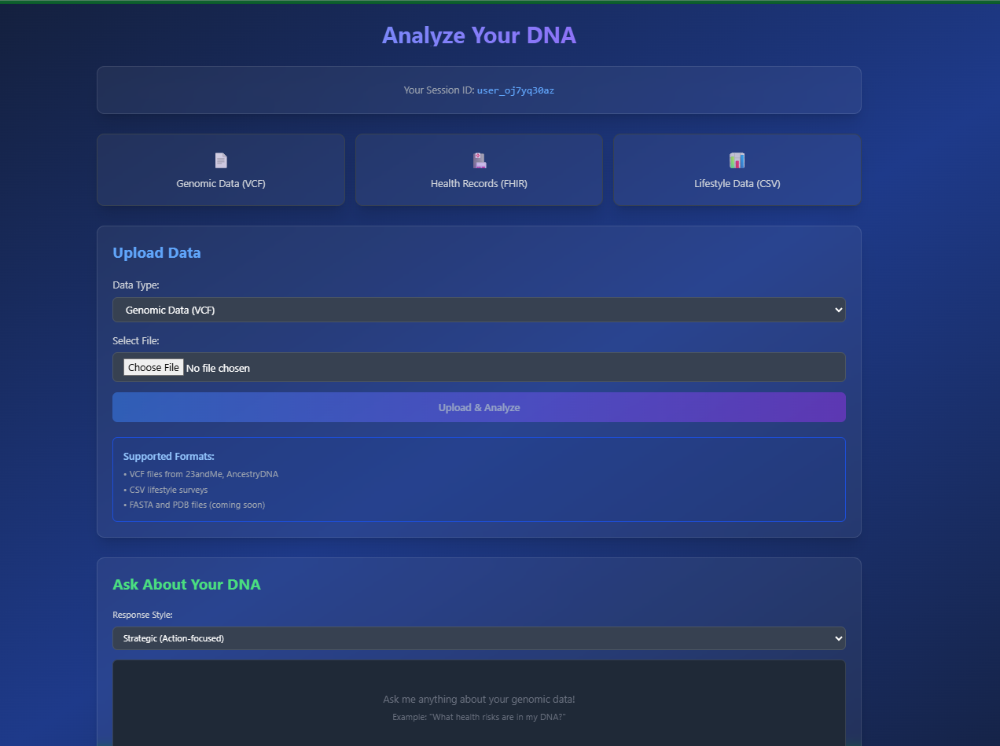
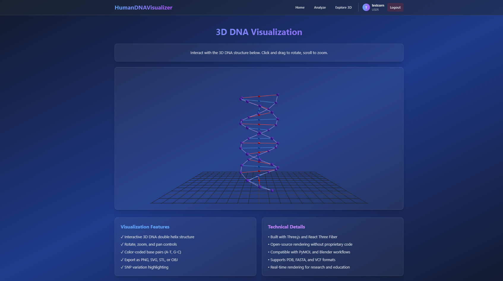
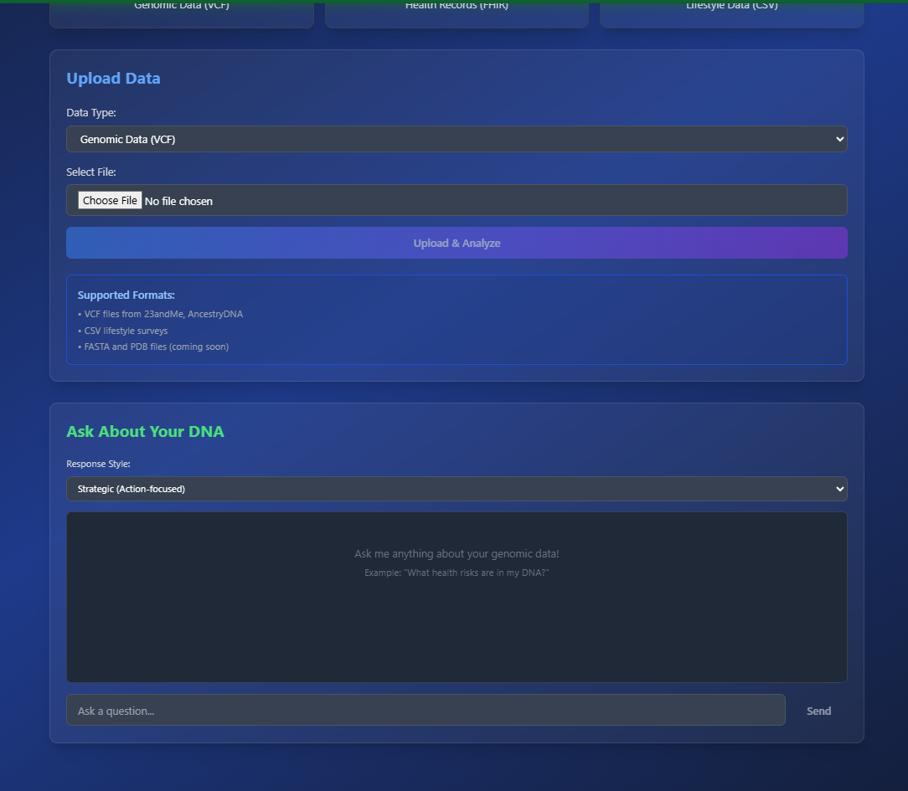

# HumanDNAVisualizer

> Democratizing genomic insights through 3D visualization and AI-driven trait predictions


## Overview

HumanDNAVisualizer is a production-ready, open-source web application that empowers individuals, researchers, and educators to explore genomic data through interactive 3D visualizations and AI-powered trait predictions. It integrates:

- **Genomic Data**: VCF files from 23andMe, AncestryDNA, FASTA, PDB
- **Phenotypic Data**: FHIR-compliant health records
- **Environmental Data**: Lifestyle surveys (CSV)

## Screenshots

### Data Upload & Analysis Interface

*Upload genomic data (VCF), health records (FHIR), and lifestyle data (CSV) with AI-powered natural language queries*

### Interactive 3D DNA Visualization

*Explore the DNA double helix structure with interactive rotation, zoom, and color-coded base pairs*

### Data Upload & LLM Chat

*Seamless integration of data upload with personalized AI responses in multiple styles*

### Key Features

- 🧬 **Data Integration**: Upload and parse VCF, FHIR, CSV, JSON, PDB, and FASTA formats
- 🎨 **3D Visualization**: Interactive DNA structures built with Three.js
- 🤖 **AI Predictions**: PyTorch-powered trait predictions for health risks and cognitive traits
- 💬 **Natural Language Queries**: Ask questions about your genomic data in plain English
- 🌍 **Global Accessibility**: Open-source design for diverse populations
- 🔒 **Privacy & Security**: GDPR and HIPAA compliant with encryption

## Why HumanDNAVisualizer?

Unlike proprietary tools (PyMOL, SnapGene) or general 3D software (Blender), HumanDNAVisualizer:
- **Integrates** genomic, phenotypic, and environmental data in one platform
- **Democratizes** access with open-source architecture
- **Personalizes** insights with AI and natural language processing
- **Focuses** on diverse populations, especially those with high genetic diversity

## Architecture

```
HumanDNAVisualizer/
├── backend/               # Spring Boot microservices (Java 17)
│   └── dna-integrator/    # Data integration service
├── frontend/              # React 18 + Three.js
├── ai-model/              # PyTorch trait predictor (Python)
├── llm-service/           # Natural language query service (Python)
└── database/              # PostgreSQL schemas
```

## Tech Stack

| Layer | Technology |
|-------|-----------|
| **Frontend** | React 18, Three.js, Tailwind CSS, Vite |
| **Backend** | Java 17, Spring Boot 3, Spring Data JPA |
| **AI/ML** | Python 3.10, FastAPI, PyTorch, BioPython |
| **Database** | PostgreSQL 15, Redis |
| **Infrastructure** | Docker, Docker Compose, NGINX |

## Prerequisites

- **Docker** 20.10+ and **Docker Compose** 2.0+
- **Node.js** 18+ (for local frontend development)
- **Java** 17+ (for local backend development)
- **Python** 3.10+ (for local AI service development)
- **Git**

## Quick Start

### Option 1: One-Command Start (Recommended for Demo)

**Windows:**
```bash
start-demo.bat
```

**Linux/Mac:**
```bash
chmod +x start-demo.sh
./start-demo.sh
```

This automatically starts:
- ✅ Backend API (Port 8081) with demo mode enabled
- ✅ AI Model Service (Port 8000)
- ✅ Frontend (Port 3000)
- ✅ Auto-creates demo users (demo/demo123, admin/admin123)

**To stop all services:**
```bash
stop-all.bat  # Windows
./stop-all.sh  # Linux/Mac
```

See [STARTUP-SCRIPTS-GUIDE.md](STARTUP-SCRIPTS-GUIDE.md) for details.

### Option 2: Docker Compose

### 1. Clone the Repository

```bash
git clone <repository-url>
cd HumanDNAVisualizer
```

### 2. Configure Environment

```bash
cp .env.example .env
# Edit .env with your configuration
```

### 3. Launch with Docker Compose

```bash
docker-compose up --build
```

This will start:
- **Frontend**: http://localhost:3000
- **DNA Integrator API**: http://localhost:8081
- **AI Model Service**: http://localhost:8000
- **LLM Service**: http://localhost:8002
- **PostgreSQL**: localhost:5432
- **Redis**: localhost:6379

### 4. Access the Application

Open your browser and navigate to **http://localhost:3000**

## Usage Guide

### Step 1: Upload Your Data

1. Navigate to the **Analyze** page
2. Select your data type:
   - **VCF**: Genomic variants from 23andMe, AncestryDNA
   - **CSV**: Lifestyle and environmental data
   - **FHIR**: Health records (JSON format)
3. Click **Upload & Analyze**

### Step 2: View AI Predictions

After uploading VCF data, the system automatically:
- Parses genetic variants
- Runs AI predictions for:
  - Type 2 Diabetes Risk
  - Cardiovascular Disease Risk
  - Memory & Cognitive Function
  - Vitamin D Metabolism
  - Caffeine Metabolism
- Displays personalized recommendations

### Step 3: Explore 3D Visualizations

1. Navigate to the **Explore 3D** page
2. Interact with the DNA double helix:
   - **Rotate**: Click and drag
   - **Zoom**: Scroll wheel
   - **Pan**: Right-click and drag
3. Observe color-coded base pairs and SNP variations

### Step 4: Ask Questions

Use the **LLM Chat** interface to ask:
- "What health risks are in my DNA?"
- "How do my genes affect my memory?"
- "What lifestyle changes should I make?"

Choose response style (Strategic, Empathetic, Creative, Analytical, Quick Tips) for personalized answers.

## Supported Data Formats

### Genomic Data (VCF)
```
#CHROM  POS     ID      REF     ALT     QUAL    FILTER
1       12345   rs123   A       T       30.0    PASS
```

### Health Records (FHIR R4)
```json
{
  "resourceType": "Observation",
  "code": {
    "coding": [{"system": "http://loinc.org", "code": "2339-0"}]
  },
  "valueQuantity": {"value": 5.4, "unit": "mmol/L"}
}
```

### Lifestyle Data (CSV)
```csv
diet,exercise_frequency,smoking_status,stress_level
vegetarian,weekly,never,moderate
```

## Development

### Local Frontend Development

```bash
cd frontend
npm install
npm run dev
```

### Local Backend Development

```bash
cd backend/dna-integrator
mvn clean install
mvn spring-boot:run
```

### Local AI Service Development

```bash
cd ai-model
pip install -r requirements.txt
python trait_predictor.py
```

## API Documentation

### DNA Integrator Service (Port 8081)

#### Upload VCF
```
POST /api/data/upload/vcf
Content-Type: multipart/form-data

Parameters:
- file: VCF file
- userId: User identifier
```

#### Get Genomic Data
```
GET /api/data/genomic/{userId}
```

### AI Model Service (Port 8000)

#### Predict Traits
```
POST /predict?user_id={userId}
Content-Type: application/json

Body:
{
  "variants": [
    {"chromosome": "1", "position": 12345, "alternateAllele": "T"}
  ],
  "phenotypic_data": {},
  "environmental_data": {}
}
```

### LLM Service (Port 8002)

#### Query LLM
```
POST /query
Content-Type: application/json

Body:
{
  "user_id": "user123",
  "query": "What health risks are in my DNA?",
  "query_type": "health_risk",
  "personality_preference": "strategic"
}
```

## Security & Privacy

- **Encryption**: TLS for data in transit, AES-256 for data at rest
- **Authentication**: JWT tokens, OAuth2 support
- **Compliance**: GDPR and HIPAA aligned
- **Input Validation**: Prevents injection attacks
- **Rate Limiting**: Protects against abuse
- **No Proprietary Code**: 100% open-source libraries

## Copyright & License

HumanDNAVisualizer is released under the **MIT License**.

### Copyright Notice

This is an original open-source work using Apache/MIT licensed libraries:
- **No proprietary code** from PyMOL, Blender, Adenita, Web 3DNA, UNIQUIMER, or SnapGene
- **Compatible** with VCF, FHIR, CSV, JSON, PDB, FASTA, and .dna formats
- **All third-party libraries** are properly licensed (see LICENSE file)

### Library Licenses

All dependencies use permissive open-source licenses:
- **Spring Boot**: Apache License 2.0
- **HAPI FHIR**: Apache License 2.0
- **BioJava**: LGPL 2.1
- **React**: MIT License
- **Three.js**: MIT License
- **PyTorch**: BSD License
- **FastAPI**: MIT License
- **BioPython**: BSD License

See `LICENSE` file for complete details.

## Contributing

We welcome contributions! Please:
1. Fork the repository
2. Create a feature branch
3. Submit a pull request with tests
4. Ensure all linters pass

## Troubleshooting

### VCF Upload Fails
- Verify VCF format compliance
- Check file size (max 50MB)
- Ensure no special characters in filename

### 3D Visualization Slow
- Large datasets may take 30-60 seconds
- Check browser performance (Chrome/Firefox recommended)
- Try reducing data complexity

### Docker Build Issues
- Ensure Docker has sufficient memory (8GB+ recommended)
- Clear Docker cache: `docker system prune -a`

## Roadmap

- [ ] Real-time collaboration features
- [ ] Mobile app (React Native)
- [ ] Additional file format support (GFF3, BAM)
- [ ] Ancestry visualization enhancements
- [ ] Multi-language support
- [ ] Integration with more genomic databases

## Citation

If you use HumanDNAVisualizer in research, please cite:

```
HumanDNAVisualizer: An Open-Source Platform for Genomic Data Visualization and AI-Driven Trait Prediction
Available at: <repository-url>
License: MIT
```

## Support

- **Issues**: Report bugs at GitHub Issues
- **Documentation**: See `/docs` folder
- **Community**: Join our discussions

## Acknowledgments

Built with support from the open-source community and inspired by the need to democratize genomic insights for diverse global populations.

---

**Advancing humanity through accessible genomic science** 🧬
